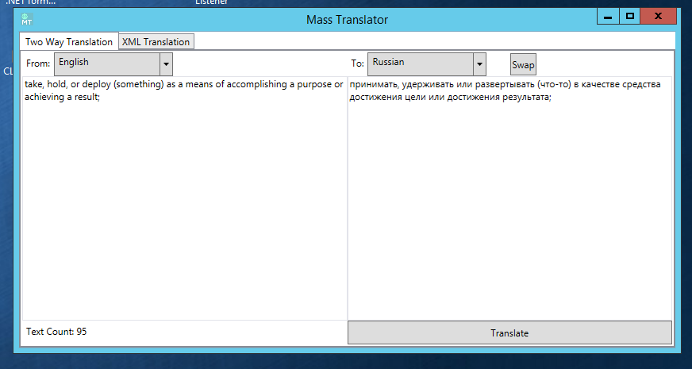
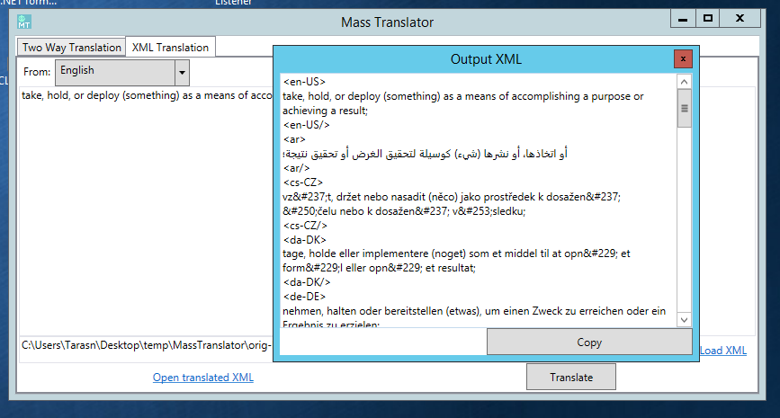

# MassTranslator

Mass Translator can be used to translate specially formatted XML files, such as those used for submitting translations to the Google Play Market. In addition, the app can translate text from one language to another using the Google Translation service.

